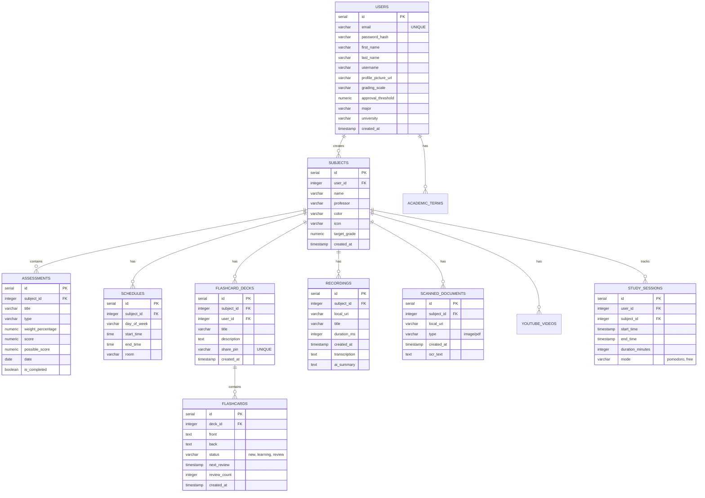

# Database Schema & ERD

Este documento muestra la arquitectura relacional de la base de datos PostgreSQL de **Threshold**, gestionando usuarios, materias, y todas las entidades académicas.

## Entidad Relación (ERD)

## Características Clave

1. **Eficiencia Relacional**: Cada tabla pertenece a un usuario (a través de `user_id` o derivado de `subject_id`).
2. **Sistema Colaborativo**: `FLASHCARD_DECKS` implementa un `share_pin` que permite el cruce de `user_id` para compartir recursos.
3. **Optimización**: Se usa `serial` para los ID's y se prefieren claves numéricas para asegurar búsquedas O(log N) rápidas en índices B-Tree.
